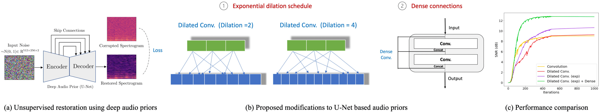

# On the Design of Deep Priors for Unsupervised Audio Restoration
Refer to diagram below for a summary of the approach. 



## Requirements
* python 3.6
* numpy >= 1.11.0
* pytorch = 1.5.0
* scikit-learn >= 0.18
* matplotlib >= 2.1.0
* librosa


### Perform Denoising
Run ```./denoising/script.py``` to perform audio denoising on a single audio excerpt (LJSpeech, Digits, Piano). 

## Example


